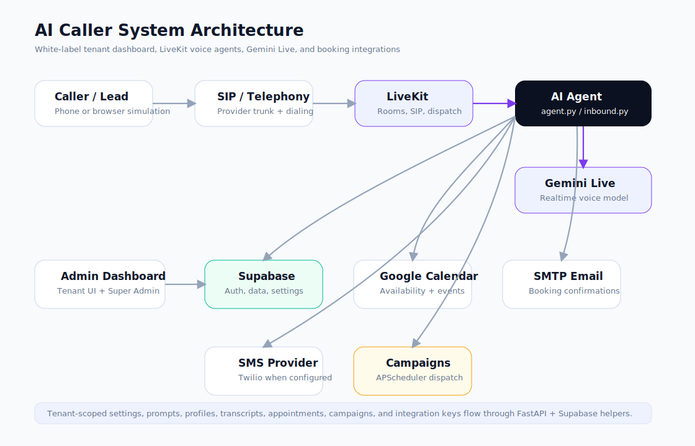
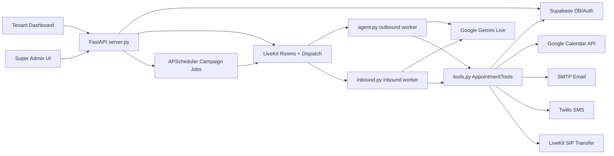
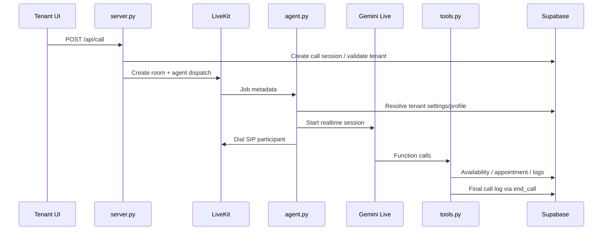

# AI Caller System


AI Caller System is a multi-tenant, white-label AI voice calling platform for outbound and inbound appointment workflows. It combines a FastAPI dashboard, LiveKit voice agents, Google Gemini realtime audio, SIP telephony, Supabase persistence, Google Calendar scheduling, SMTP email confirmations, Twilio SMS support, campaign dispatching, tenant branding, and super-admin operations.

The repository is structured as a single Python application with static HTML/CSS/JavaScript dashboards in `ui/`.

## Features

### Voice Calling

- Outbound AI calls through LiveKit SIP dispatch.
- Inbound AI receptionist worker through a separate LiveKit agent.
- Browser-based simulated call flow for local testing.
- Active call status derived from dispatch state, call logs, and transcript history.
- Transcript persistence and recent transcript viewing.
- Call log recording URL storage and playback when a recording URL is available.
- Fallback call-end logging when a model does not call `end_call`.

### AI Agent

- Google Gemini Live / realtime model support.
- Tenant and profile-aware prompt construction.
- Agent profiles with name, voice, model, default profile, and tool configuration.
- Mandatory booking and grounding rules in prompts and tool guards.
- Runtime tools for availability, booking, CRM memory, SMS, email, transfer, and call finalization.
- Hindi and multi-language conversation behavior through Gemini and prompt-level language mirroring.
- Contact memory/context tools through `lookup_contact`, `remember_details`, and contact-memory storage.

### Appointment Booking

- Supabase-backed appointment storage.
- Availability checks against Supabase appointments.
- Optional Google Calendar availability checks and event creation.
- Booking IDs and call log outcomes.
- Email status reporting for booking confirmations.
- Email Booking templates and automatic booking email controls.
- Optional SMS confirmation tool.

### Campaigns

- CSV/contact-list campaign creation.
- One-time, daily, and weekday campaign scheduling with APScheduler.
- Manual campaign runs.
- Campaign status, dispatch counters, and failure tracking fields.

### White-Label / SaaS Administration

- Tenant records with company name, slug, status, branding, billing mode, and wallet balance.
- Tenant-scoped settings, prompts, campaigns, calls, appointments, transcripts, logs, CRM, and agent profiles.
- Tenant-specific SMTP/email settings, Google Calendar settings, prompts, agent profiles, and Email Booking templates.
- Super-admin console for tenant creation, status changes, branding, wallet adjustment, API keys, audit logs, usage, and pricing.
- BYOK-style tenant API key storage for selected integration keys.
- Admin and tenant roles backed by Supabase Auth and the local `users` / `tenant_users` tables.
- Managed wallet gating for tenant operations.

### Dashboard UI

- Tenant dashboard with workflow sidebar navigation.
- Dashboard, Calls, CRM, Appointments, Analytics, Inbound, Settings, Admin tools, Logs, and Live Transcripts.
- Settings hub with integration panels for LiveKit, Gemini, SIP, Twilio, Google Calendar, Supabase/Storage, Email Settings, Admin Security, and Advanced settings.
- Admin Email Booking tab for automatic booking confirmation behavior and templates.
- Searchable/filterable tables for calls, CRM, appointments, campaigns, and profiles.

## Architecture





## Core Components

| File | Responsibility |
| --- | --- |
| `server.py` | FastAPI application, static UI serving, authentication middleware, tenant context setup, call dispatch, inbound dispatch, campaign APIs, settings APIs, health checks, logs, transcripts, CRM, appointments, agent profiles, super-admin APIs, wallet/pricing endpoints, and scheduler startup. |
| `agent.py` | Outbound LiveKit worker named `outbound-caller`. Resolves metadata, tenant context, prompt, profile, tools, Gemini session, SIP dialing, transcripts, active call lifecycle, identity/booking safety, and fallback call logging. |
| `inbound.py` | Inbound LiveKit worker named `inbound-caller`. Handles inbound room metadata, prompt/profile/tool setup, transcripts, and fallback logging for inbound calls. |
| `tools.py` | Gemini-callable tool context. Implements availability checks, appointment booking, email, SMS, contact memory, human transfer, Cal.com placeholders, and `end_call`. |
| `db.py` | Supabase client helpers, tenant context variables, settings, appointments, calls, transcripts, campaigns, CRM, agent profiles, users, tenants, wallet, audit logs, API keys, and pricing helpers. |
| `prompts.py` | Default realtime voice prompt and interpolation helper. |
| `gcal.py` | Google Calendar service-account integration for availability and event creation. |
| `email_manager.py` | SMTP email rendering and sending helpers for booking confirmation emails. |
| `ui/index.html` | Tenant dashboard single-page application. |
| `ui/admin.html` | Super-admin console for tenant/platform administration. |
| `supabase_schema.sql` | Database schema, tenant columns, white-label tables, indexes, and Supabase Auth support tables. |
| `start.sh` | Production/container startup script that runs FastAPI and the outbound LiveKit worker. |
| `Dockerfile` | Python 3.11 container image. |
| `render.yaml` | Render deployment definition. |

## Supported Capabilities

- Outbound AI calling.
- Inbound AI calling through a separate worker.
- Appointment booking with Supabase persistence.
- Google Calendar availability and event sync.
- SMTP booking confirmation email support.
- Twilio SMS confirmation support when configured.
- Human transfer via LiveKit SIP transfer.
- Campaign calling with scheduled runs.
- Agent profile management.
- Global and profile-specific prompts.
- Tenant dashboard and super-admin dashboard.
- White-label tenant branding and tenant API key storage.
- Wallet balance tracking and managed tenant operation gating.
- Call logs, CRM summaries, appointments, transcripts, logs, and analytics.

## White-Label Platform

This branch includes a working white-label SaaS foundation with tenant-scoped runtime settings, tenant branding, super-admin controls, wallet gates, tenant API keys, tenant-specific AI profiles, and tenant-specific booking/email configuration.

### What Exists

- `tenants` table with company, slug, branding, status, billing mode, wallet balance, support email, website, logo, favicon, and colors.
- `tenant_id` columns on major operational tables.
- Request-scoped tenant context in `db.py` using context variables.
- Tenant-specific settings through the `settings` table.
- Tenant-specific global prompt, custom agent profiles, model/voice settings, enabled tools, and campaign prompts.
- Tenant-specific SMTP settings and Email Booking templates.
- Tenant-specific Google Calendar service account JSON, calendar ID, and slot duration.
- Tenant-specific LiveKit/Gemini/SIP/Twilio/Supabase settings through the tenant dashboard.
- Super-admin tenant management in `ui/admin.html`.
- Tenant API key storage for BYOK-style integrations.
- Managed wallet balance checks before selected tenant operations.
- Tenant onboarding/profile/branding routes.

### Roles and Permissions

| Role | Scope |
| --- | --- |
| `SUPER_ADMIN` | Platform console access, tenant creation/update, tenant status changes, pricing, API keys, wallet adjustment, usage, audit logs, and impersonation. |
| `TENANT_ADMIN` | Tenant dashboard access, tenant settings, calls, appointments, campaigns, prompts, agent profiles, logs, and Email Booking controls. |
| `TENANT_USER` | Authenticated tenant user role. The current UI primarily exposes tenant dashboard behavior after middleware resolves tenant context. |

### Tenant-Specific Configuration

Tenant configuration is saved in the tenant-scoped `settings` table or, for selected BYOK-style fields, in `tenant_api_keys`. The dashboard includes panels for:

- LiveKit Cloud credentials.
- Google Gemini API/model/voice settings.
- SIP / telephony credentials and outbound trunk.
- Twilio SMS credentials.
- Google Calendar service account and calendar ID.
- SMTP credentials.
- Email Booking behavior and templates.
- Global AI prompt and agent profiles.
- Default business and service names.

### Isolation Model

Most application data access is tenant-scoped in application code through helper functions in `db.py`. The schema currently disables Row Level Security on most operational tables and enables it only on selected auth-related tables such as `users` and `tenant_users`.

For production SaaS, treat app-layer tenant scoping as important but not sufficient by itself. Database-level RLS policies should be added before hosting untrusted tenants at scale.

## Calling Flow

### Outbound Call



### Inbound Call

Inbound calls are dispatched through `/api/inbound/dispatch` and handled by the `inbound-caller` LiveKit worker in `inbound.py`. The inbound worker shares the same prompt/tool/database infrastructure but has its own entrypoint and agent name.

### Booking Flow

1. The AI collects date, time, lead details, service, and optional email.
2. `check_availability` validates Supabase appointment availability and optionally Google Calendar availability.
3. `book_appointment` inserts the appointment in Supabase.
4. If configured, Google Calendar event creation runs and stores `gcal_event_id` / `gcal_event_link`.
5. If automatic booking email is enabled and SMTP is configured, an email can be queued/sent through `email_manager.py`.
6. `end_call(outcome="booked")` is only valid after a booking succeeds.

## Recent Platform Improvements

The current branch includes production-oriented improvements around speed, logging, and tool grounding:

- Per-call availability caching to avoid repeated `check_availability` calls for the same slot.
- Cached tool/settings reads inside `AppointmentTools`.
- Faster booking workflow with Google Calendar calls moved off the event loop and bounded by timeouts.
- Google Calendar synchronization with event ID/link persistence.
- Email Booking management tab for automatic booking emails and template editing.
- Automatic booking confirmation email flow controlled by `AUTO_SEND_BOOKING_EMAIL`.
- Tenant health indicators for configured LiveKit, Gemini, Supabase, and SIP services.
- Production log cleanup flags through `DEBUG_LIVEKIT_EVENTS` and `DEBUG_TOOL_LOGS`.
- Appointment workflow hardening that prevents `booked` outcomes without a successful booking.
- Improved booking grounding rules for availability, booking, SMS, calendar, email, and demo-link claims.
- Email grounding safeguards so the assistant cannot claim delivery unless `send_email` or automatic email status confirms it.

## Backend Routes

Major API groups implemented by `server.py`:

| Group | Routes |
| --- | --- |
| UI | `GET /`, `GET /ui/admin.html`, static `/ui/*` |
| Auth | `GET /api/auth/config`, `POST /api/auth/register`, `GET /api/auth/context` |
| Tenant profile | `GET/POST /api/white-label/settings`, `GET/POST /api/profile`, `GET /api/pricing`, `POST /api/onboard`, `POST /api/upload` |
| Super admin | `/api/super-admin/summary`, `/tenants`, `/pricing`, `/audit-logs`, tenant detail/update/status, tenant usage, API keys, wallet add/deduct, impersonation |
| Wallet | `POST /api/wallet/add` |
| Calls | `POST /api/call`, `GET /api/calls`, `GET /api/calls/active`, `PATCH /api/calls/{call_id}/notes` |
| Inbound | `POST /api/inbound/dispatch` |
| Dashboard | `GET /api/stats`, `GET /api/health` |
| Appointments | `GET /api/appointments`, `DELETE /api/appointments/{appointment_id}` |
| Prompt | `GET/POST/DELETE /api/prompt` |
| Settings | `GET/POST /api/settings` |
| Email booking | `POST /api/email-booking/test` |
| SIP setup | `POST /api/setup/trunk` |
| Logs/transcripts | `GET/DELETE /api/logs`, `GET /api/transcripts/recent` |
| CRM | `GET /api/crm`, `GET /api/crm/calls` |
| Agent profiles | CRUD under `/api/agent-profiles` plus set-default |
| Campaigns | `POST/GET/DELETE /api/campaigns`, run-now, status patch |
| Simulation | `POST /api/simulate-call` |

## Frontend Features

### Tenant Dashboard (`ui/index.html`)

- Dashboard with KPIs, active calls, recent activity, connection chips, and quick actions.
- Calls workspace: single call console, batch calls, campaigns, call logs, live transcripts, and inbound calls.
- CRM and appointment tables with search/filter behavior.
- Analytics panels using call statistics.
- Admin workspace: agents, AI Prompt, Setup, Logs, and Email Booking.
- Settings hub with mini-panels for integrations.
- Login/auth bootstrap through Supabase Auth.

### Super Admin Console (`ui/admin.html`)

- Tenant workspace with tenant search/filter.
- Tenant creation and invitation.
- Tenant status and billing-mode controls.
- Branding, API keys, wallet adjustments, usage, and audit logs.
- Platform pricing controls.

## Authentication and Authorization

The backend uses Supabase Auth tokens from either the `Authorization: Bearer` header or `sb-access-token` cookie. The HTTP middleware in `server.py` verifies the Supabase token, loads the local `users` record, sets request tenant context, and protects dashboard/API routes.

Roles include tenant users/admins and `SUPER_ADMIN`. Super-admin routes require `SUPER_ADMIN`. Tenant operations are scoped to the current tenant context and may be blocked if the tenant is inactive or wallet-gated.

Unauthenticated routes are limited to login/signup/config, health, and the simulated-call endpoint as implemented.

## Database and Supabase

Supabase is used for:

- Auth token verification.
- Operational storage: appointments, calls, sessions, settings, transcripts, logs, campaigns, contact memory, and agent profiles.
- White-label storage: tenants, tenant API keys, audit logs, user records, tenant users, and pending invites.
- Optional file upload target paths for branding assets.

The backend creates Supabase clients in `db.py` using `SUPABASE_URL` and `SUPABASE_SERVICE_KEY`. The frontend also needs `SUPABASE_ANON_KEY` for browser-side Supabase Auth setup.

## Environment Variables

The table below lists variables found in the code and `.env.example`. Some values can also be configured per tenant through the Settings UI.

| Variable | Purpose | Required |
| --- | --- | --- |
| `LIVEKIT_URL` | LiveKit Cloud/WebSocket URL. | Yes |
| `LIVEKIT_API_KEY` | LiveKit API key. | Yes |
| `LIVEKIT_API_SECRET` | LiveKit API secret. | Yes |
| `GOOGLE_API_KEY` | Google Gemini API key. | Yes |
| `GEMINI_MODEL` | Gemini realtime model name. | No |
| `GEMINI_TTS_VOICE` | Gemini voice name. | No |
| `USE_GEMINI_REALTIME` | Realtime mode toggle. | No |
| `SUPABASE_URL` | Supabase project URL. | Yes |
| `SUPABASE_SERVICE_KEY` | Supabase service role key for backend operations. | Yes |
| `SUPABASE_ANON_KEY` | Supabase anonymous key for browser auth. | Yes for UI auth |
| `VOBIZ_SIP_DOMAIN` | SIP provider domain. | Required for real SIP calls |
| `VOBIZ_USERNAME` | SIP username. | Required for real SIP calls |
| `VOBIZ_PASSWORD` | SIP password. | Required for real SIP calls |
| `VOBIZ_OUTBOUND_NUMBER` | Outbound caller ID number. | Required for real SIP calls |
| `OUTBOUND_TRUNK_ID` | LiveKit outbound SIP trunk ID. | Required for outbound dialing |
| `DEFAULT_TRANSFER_NUMBER` | Human transfer destination. | No |
| `TWILIO_ACCOUNT_SID` | Twilio account SID for SMS. | No |
| `TWILIO_AUTH_TOKEN` | Twilio auth token for SMS. | No |
| `TWILIO_FROM_NUMBER` | Twilio sender phone number. | No |
| `GOOGLE_CALENDAR_SERVICE_ACCOUNT_JSON` | Google Calendar service account JSON. | No |
| `GOOGLE_CALENDAR_ID` | Calendar ID for availability/events. | No |
| `GOOGLE_CALENDAR_SLOT_DURATION` | Appointment duration in minutes. | No |
| `SMTP_HOST` | SMTP server host. | No |
| `SMTP_PORT` | SMTP server port. | No |
| `SMTP_USERNAME` | SMTP username. | No |
| `SMTP_PASSWORD` | SMTP password. | No |
| `SMTP_FROM` | Sender email address. | No |
| `SMTP_DISPLAY_NAME` | Sender display name. | No |
| `AUTO_SEND_BOOKING_EMAIL` | Enables automatic booking confirmation email. | No |
| `BOOKING_EMAIL_SUBJECT_TEMPLATE` | Booking email subject template. | No |
| `BOOKING_EMAIL_BODY_TEMPLATE` | Booking email body template. | No |
| `BOOKING_EMAIL_REPLY_TO` | Optional reply-to address. | No |
| `BOOKING_EMAIL_SIGNATURE` | Optional email footer/signature. | No |
| `CALCOM_API_KEY` | Optional Cal.com API key. | No |
| `CALCOM_EVENT_TYPE_ID` | Optional Cal.com event type. | No |
| `CALCOM_TIMEZONE` | Optional Cal.com timezone. | No |
| `S3_ACCESS_KEY_ID` | Optional S3-compatible recording storage key. | No |
| `S3_SECRET_ACCESS_KEY` | Optional S3-compatible recording storage secret. | No |
| `S3_ENDPOINT_URL` | Optional S3-compatible endpoint. | No |
| `S3_REGION` | Optional storage region. | No |
| `S3_BUCKET` | Optional recording bucket. | No |
| `DEEPGRAM_API_KEY` | Optional pipeline fallback STT key. | No |
| `DEBUG_LIVEKIT_EVENTS` | Enables verbose LiveKit event logging. | No |
| `DEBUG_TOOL_LOGS` | Enables verbose tool argument/result logging. | No |
| `GCAL_AVAILABILITY_TIMEOUT_SECONDS` | Google Calendar availability timeout. | No |
| `GCAL_EVENT_TIMEOUT_SECONDS` | Google Calendar event creation timeout. | No |
| `AVAILABILITY_CACHE_TTL_SECONDS` | Per-call availability cache TTL. | No |
| `PORT` | HTTP port for FastAPI. | No |
| `SUPER_ADMIN_EMAILS` | Comma-separated super-admin allowlist. | No |
| `BOOTSTRAP_ADMIN_EMAIL` | Optional bootstrap admin email. | No |
| `APP_URL` / `SITE_URL` | Invite redirect base URL. | No |
| `DEFAULT_TENANT_ID` | Default tenant identifier. | No |
| `DEFAULT_COMPANY_NAME` | Default tenant company name. | No |
| `DEFAULT_TENANT_SLUG` | Default tenant slug. | No |
| `DEFAULT_BILLING_MODE` | Default tenant billing mode. | No |
| `DEFAULT_WALLET_BALANCE` | Initial default tenant wallet balance. | No |
| `DEFAULT_WALLET_LOW_BALANCE_THRESHOLD` | Wallet warning threshold. | No |
| `ALLOW_INSECURE_SSL` | Explicit unsafe SSL escape hatch if implemented. | No |

## Installation

### Windows

```powershell
cd D:\AI-Caller-System-main\AI-Caller-System-white-label-test
py -3.11 -m venv .venv
.\.venv\Scripts\Activate.ps1
pip install --upgrade pip
pip install -r requirements.txt
copy .env.example .env
```

Edit `.env` with your own credentials.

### Linux / macOS

```bash
cd AI-Caller-System-white-label-test
python3.11 -m venv .venv
source .venv/bin/activate
pip install --upgrade pip
pip install -r requirements.txt
cp .env.example .env
```

## Running Locally

Run the FastAPI dashboard:

```bash
uvicorn server:app --reload --host 0.0.0.0 --port 8000
```

Run the outbound LiveKit worker in a second terminal:

```bash
python agent.py dev
```

or for production-style worker mode:

```bash
python agent.py start
```

Run the inbound worker in a separate terminal when testing inbound calls:

```bash
python inbound.py dev
```

Open:

- Tenant dashboard: `http://localhost:8000/`
- Login page: `http://localhost:8000/ui/login.html`
- Signup page: `http://localhost:8000/ui/signup.html`
- Super-admin console: `http://localhost:8000/ui/admin.html`
- API docs: `http://localhost:8000/docs`

## Google Calendar Setup

1. Create a Google Cloud service account.
2. Enable Google Calendar API for the project.
3. Create a JSON key for the service account.
4. Share the target Google Calendar with the service account email.
5. In the tenant dashboard, open Settings -> Google Calendar.
6. Paste the service account JSON.
7. Set `GOOGLE_CALENDAR_ID` to `primary`, a calendar email address, or a calendar ID.
8. Set `GOOGLE_CALENDAR_SLOT_DURATION` in minutes.

Google Calendar events are created without customer attendees in the current implementation, so the assistant must not claim that a customer received a calendar invite unless a separate email/SMS tool confirms delivery.

## Email Setup

SMTP credentials are configured in Settings -> Email Settings:

- SMTP host
- SMTP port
- SMTP username
- SMTP password
- From email
- Display name

Booking confirmation behavior is configured in Admin -> Email Booking:

- Enable/disable automatic booking confirmation email.
- Subject template.
- Body template.
- Reply-to email.
- Signature/footer.
- Test email recipient.

Available booking email placeholders include:

- `{lead_name}`
- `{business_name}`
- `{service_type}`
- `{date}`
- `{time}`
- `{phone}`
- `{email}`
- `{booking_id}`
- `{calendar_link}`

Automatic booking email is controlled by `AUTO_SEND_BOOKING_EMAIL`. SMTP credentials alone do not force emails to be sent.

## SMS Setup

Twilio SMS settings are available in Settings -> Twilio SMS:

- `TWILIO_ACCOUNT_SID`
- `TWILIO_AUTH_TOKEN`
- `TWILIO_FROM_NUMBER`

The SMS confirmation is exposed as a separate agent tool. The prompt requires the assistant to avoid claiming SMS delivery unless the SMS tool succeeds.

## SIP / VoIP Setup

The outbound path uses LiveKit SIP with a SIP provider/trunk configuration:

- SIP domain
- SIP username/password
- outbound caller number
- LiveKit outbound trunk ID

The setup route can create an outbound SIP trunk through LiveKit when credentials are present. Real outbound dialing requires the LiveKit worker to be running and the trunk/provider to accept the destination number format.

Human transfer uses LiveKit SIP transfer when a transfer destination is configured.

## Deployment

### Docker

```bash
docker build -t ai-caller-system .
docker run --env-file .env -p 8000:8000 ai-caller-system
```

The Docker image runs `start.sh`, which starts FastAPI and the outbound worker. If inbound calling is required, run `inbound.py start` as a separate process/service.

### Render

`render.yaml` defines a Python web service named `outboundai`:

- Build command: `pip install -r requirements.txt`
- Start command: `bash start.sh`

Configure environment variables in Render before deploying.

### Supabase

Apply `supabase_schema.sql` to the Supabase project before running the application. The backend uses the service role key, so keep it server-side only.

## Screenshots

Add screenshots after deployment or local UI verification:

### Dashboard


### Agent Management


### Campaigns


### Email Booking


### Setup & Integrations


### Call Logs


### Transcript Viewer


## Security Notes

- Do not commit `.env` or service account JSON files.
- `SUPABASE_SERVICE_KEY`, LiveKit secrets, SMTP passwords, SIP passwords, Google API keys, and Twilio auth tokens are sensitive.
- The dashboard uses Supabase Auth and backend middleware for route protection.
- Tenant isolation is primarily enforced in application code through tenant-scoped database helpers.
- Most operational tables in `supabase_schema.sql` have RLS disabled; add database RLS policies before production multi-tenant hosting with untrusted tenants.
- The backend stores masked settings in API responses, but secrets still exist in the database/settings layer.
- Call transcripts, call logs, phone numbers, emails, and appointment records are PII and should have retention and access policies before production use.
- BYOK tenant credentials are stored in `tenant_api_keys`; access and rotation policies should be defined for production.
- Automatic call recording capture is not documented as always-on. The schema and UI support `recording_url`, and playback works when a URL is present.

## Testing Checklist

### Backend

```bash
python -m py_compile server.py agent.py tools.py prompts.py db.py gcal.py email_manager.py inbound.py
```

### Manual Smoke Tests

- Sign up or log in through Supabase Auth.
- Confirm tenant context is loaded.
- Open tenant dashboard and super-admin dashboard with correct roles.
- Save LiveKit, Gemini, SIP, Google Calendar, SMTP, and Email Booking settings.
- Create an agent profile and set it as default.
- Place an outbound call.
- Run a browser simulated call.
- Dispatch an inbound call room.
- Ask for an appointment and verify availability, booking, Google Calendar sync, and call log outcome.
- Test booking with and without recipient email.
- Send a test booking email.
- Test SMS confirmation if Twilio is configured.
- Create and manually run a campaign.
- Verify active calls disappear after completion.
- Review call logs, transcripts, CRM, appointments, analytics, and logs pages.
- Test tenant suspension/wallet behavior from the super-admin console.

## Roadmap

- Add database-enforced RLS policies for tenant isolation.
- Split FastAPI, outbound worker, inbound worker, and scheduler into separate production services.
- Add deeper health checks for LiveKit, SIP, Gemini, SMTP, Google Calendar, and Twilio.
- Add first-class billing invoices and payment provider integration.
- Add usage metering by call seconds, model usage, SMS, email, and calendar operations.
- Add queue-backed email/SMS/calendar jobs for stronger retry behavior.
- Add automated regression tests for prompts, tools, routing, tenant scoping, and campaign dispatch.
- Add transcript retention controls and export/delete workflows.
- Add structured observability dashboards and alerting.

## License

License: TBD.
